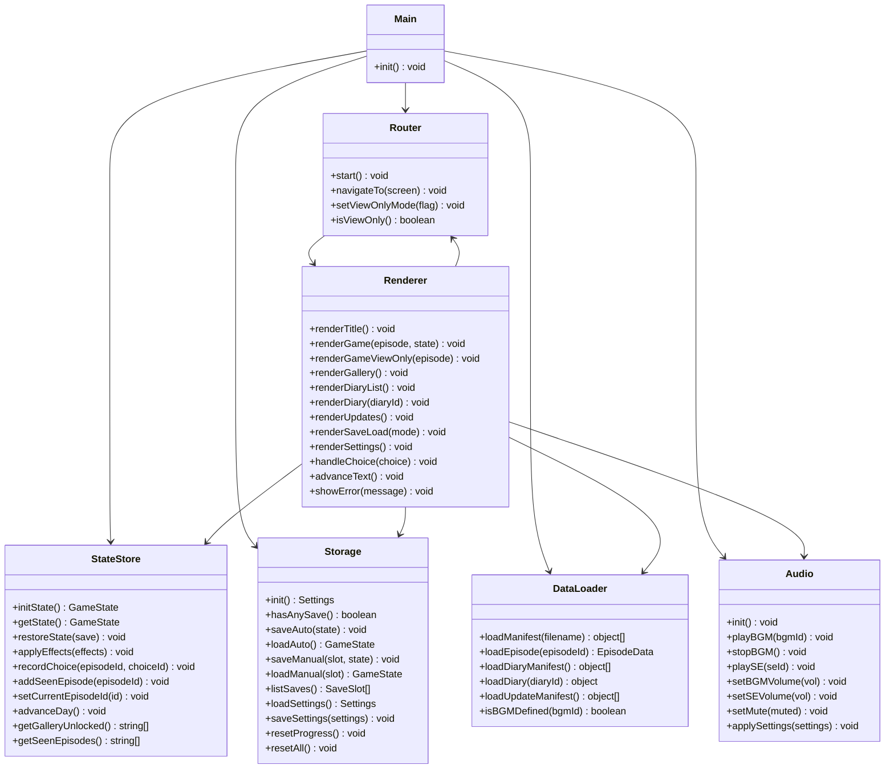

# CLASS.md（暫定TDD版）

Version: 1.1-draft
Status: Temporary source for TDD
Last Updated: 2026-03-11

## 位置づけ
この文書は、TDD着手のために必要な最小責務境界を固定するための暫定クラス図である。  
詳細設計の正本は `SPEC.md` / `USECASE.md` / `SEQUENCE.md` を優先する。  
既存の旧CLASS.mdに記載された古いAI契約や過剰結合は、本暫定版では採用しない。

---

## 1. モジュール依存関係全体図

## 2. 責務固定ルール

### 2.1 `main.js`

- アプリ起動
- 初期設定の読込
- 各モジュール初期化
- ルーター開始

### 2.2 `router.js`

- 画面遷移の単一窓口
- タイトル / ゲーム / ギャラリー / 日記 / 更新履歴 / 設定 への遷移
- 閲覧モードフラグの管理

### 2.3 `renderer.js`

- 画面描画
- テキスト送り
- 選択肢クリック受付
- `state` / `storage` / `router` / `audio` / `dataLoader` への委譲
- ゲームルールそのものは持たない

### 2.4 `state.js`

- ゲーム状態保持
- パラメータ更新
- 好感度更新
- フラグ記録
- 日付進行
- 既読 / 解放状態管理
- `advanceDay()` は同日分岐の読了時のみ呼ばれ、選択確定時には `currentDay` を進めない

### 2.5 `storage.js`

- localStorage 永続化
- オートセーブ / 手動セーブ / ロード
- 設定保存
- リセット
- セーブ破損時の復元可否判定
- `resetProgress()` は進行データのみ削除し、収集要素は保持する
- `resetAll()` は設定・収集要素を含む全ローカルデータを削除する

### 2.6 `dataLoader.js`

- JSON読込
- episode / manifest / diary / update データ取得
- 必要最小限のキャッシュ

### 2.7 `audio.js`

- Audio初期化
- BGM再生 / 停止
- SE再生
- 音量 / ミュート設定反映

## 3. TDDでの非対象

以下は本クラス図では扱わず、別文書で管理する。

- AIエージェント契約
- Scenario / Data / Publisher のI/O
- 画像生成ワークフロー
- GitHub Pages 公開処理

これらは `USECASE.md` の AIエージェント章を正本とする。

## 4. AIパイプライン境界メモ

AIパイプラインはフロント実装と分離する。

- Scenario Agent: 中間生成物を出力
- Data Agent: 正式 `episode JSON` / `updated_manifest` / `updated_updates_json` を生成
- Publisher Agent: 更新済み成果物を受け取り公開のみ行う
- Scenario Agent の人物構成正本は `characters`
- Scenario Agent の画像仕様正本は `imageRequirements`

---

## 5. テスト対象一覧

TDDの最初の着手点は、UIより先に壊れやすいロジック核を押さえる。  
`SEQUENCE.md` の流れに合わせ、状態遷移、保存、削除、解放判定を優先する。

### 優先度A: `state.js`

1. `initState` が初期状態を正しく返す
2. `applyEffects` が `affection` / `params` / `flags` を更新する
3. `recordChoice` が選択履歴を追加する
4. `addSeenEpisode` が既読エピソードを追加する
5. `setCurrentEpisodeId` が `currentEpisodeId` を更新する
6. `advanceDay` が `currentDay` を +1 し、次話進行に必要な状態を更新する
7. `getGalleryUnlocked` / `getSeenEpisodes` が現在状態を返す

### 優先度A: `storage.js`

1. `hasAnySave` が autosave の有無を正しく判定する
2. `saveAuto` / `loadAuto` が状態を往復保存できる
3. `saveManual` / `loadManual` がスロット単位で保存できる
4. `listSaves` が空 / 使用中スロットを正しく返す
5. `loadSettings` / `saveSettings` が設定を保持する
6. `resetProgress` が進行データのみ削除する
7. `resetAll` が進行データと設定を削除する
8. 破損データ読み込み時に安全に失敗する

### 優先度B: `dataLoader.js`

1. `loadEpisode` が正しいJSONを返す
2. `loadManifest` が manifest を返す
3. `loadDiaryManifest` / `loadDiary` / `loadUpdateManifest` が正しいデータを返す
4. `isBGMDefined` が存在確認を返す
5. 同一データの再読込時にキャッシュが効く

### 優先度B: `router.js`

1. `start` が初期画面へ遷移する
2. `navigateTo` が画面名に応じて `renderer` を呼ぶ
3. `setViewOnlyMode` / `isViewOnly` が閲覧モードを保持する

### 優先度C: `renderer.js`

1. `renderTitle` が save の有無でボタン強調を切り替える
2. `handleChoice` が `state.applyEffects` / `recordChoice` / `addSeenEpisode` を順に呼ぶ
3. 分岐読了時に `advanceDay` / `saveAuto` / 次話読込を呼ぶ
4. `renderGallery` が unlocked と全定義を突き合わせる
5. `renderDiaryList` が既読エピソードに応じてロック表示を切り替える
6. `renderUpdates` が updates manifest を表示する
7. エラー時に `showError` を表示する

### 優先度C: `audio.js`

1. `init` が二重初期化を避ける
2. `playBGM` が BGM を切り替える
3. `playSE` が SE を再生する
4. `setBGMVolume` / `setSEVolume` / `setMute` が設定を反映する

---

## 6. 実装順序

ここは依存の少ない順に並べる。

### Step 1

`state.js` を実装する

- `initState`
- `getState`
- `applyEffects`
- `recordChoice`
- `addSeenEpisode`
- `setCurrentEpisodeId`
- `advanceDay`

### Step 2

`storage.js` を実装する

- `hasAnySave`
- `saveAuto` / `loadAuto`
- `saveManual` / `loadManual`
- `listSaves`
- `loadSettings` / `saveSettings`
- `resetProgress` / `resetAll`

### Step 3

`dataLoader.js` を実装する

- `loadEpisode`
- `loadManifest`
- `loadDiaryManifest`
- `loadDiary`
- `loadUpdateManifest`
- `isBGMDefined`

### Step 4

`router.js` を実装する

- `start`
- `navigateTo`
- `setViewOnlyMode`
- `isViewOnly`

### Step 5

`audio.js` を実装する

- `init`
- `playBGM`
- `playSE`
- 音量設定系

### Step 6

`renderer.js` を実装する

- `renderTitle`
- `renderGame`
- `handleChoice`
- `renderGallery`
- `renderDiaryList`
- `renderUpdates`
- `renderSaveLoad`
- `renderSettings`

### Step 7

結合テスト

- 最初から開始
- 続きから再開
- 分岐遷移
- オートセーブ
- 全データ削除
- ギャラリー閲覧
- 日記閲覧
- 更新履歴閲覧

---

## 7. 固定しておく判断

- 旧CLASS.mdのAI契約は採用しない
- AI側は `Scenario Agent = 中間生成物`、`Data Agent = 正式 JSON と updated_manifest / updated_updates_json`、`Publisher Agent = 公開のみ` を正本にする
- フロント側は `renderer = 表示中心`、`state = 状態更新`、`storage = 永続化`、`router = 画面切替` で責務を固定する
