# 放課後シグナル クラス図

Version: 1.0
Last Updated: 2026-03-11

---

## 目次

1. [モジュール依存関係全体図](#1-モジュール依存関係全体図)
2. [コアモジュール詳細](#2-コアモジュール詳細)
   - [main.js](#21-mainjs)
   - [router.js](#22-routerjs)
   - [renderer.js](#23-rendererjs)
   - [state.js](#24-statejs)
   - [storage.js](#25-storagejs)
   - [dataLoader.js](#26-dataloaderjs)
   - [audio.js](#27-audiojs)
3. [ゲーム状態データクラス](#3-ゲーム状態データクラス)
4. [エピソードデータクラス](#4-エピソードデータクラス)
5. [セーブ・設定データクラス](#5-セーブ設定データクラス)
6. [マニフェスト・更新履歴データクラス](#6-マニフェスト更新履歴データクラス)
7. [キャラクターデータクラス](#7-キャラクターデータクラス)
8. [AI エージェント入出力契約](#8-ai-エージェント入出力契約)
9. [列挙型・定数](#9-列挙型定数)

---

## 1. モジュール依存関係全体図

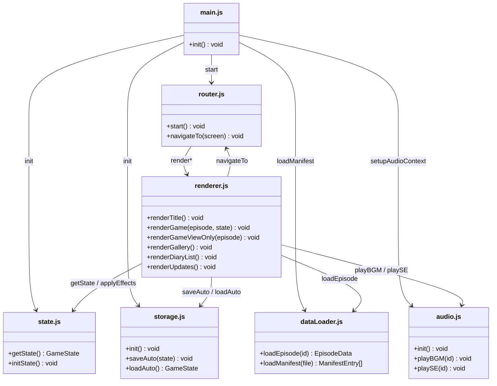

---

## 2. コアモジュール詳細

### 2.1 main.js

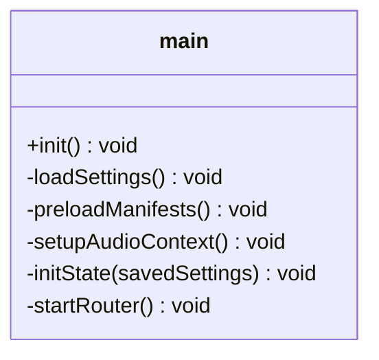

---

### 2.2 router.js

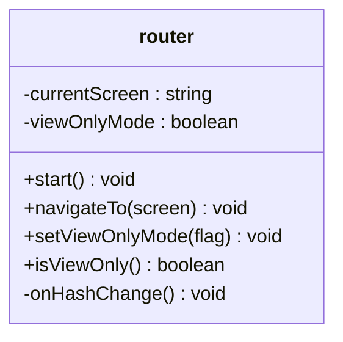

---

### 2.3 renderer.js

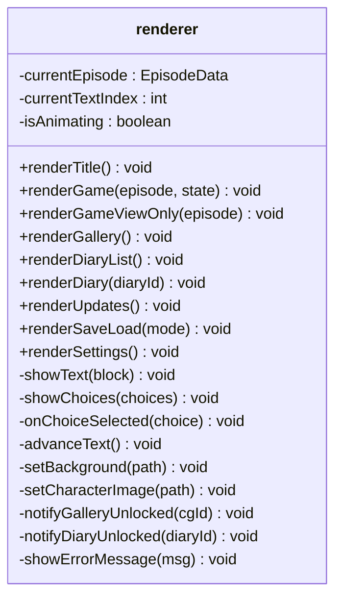

---

### 2.4 state.js

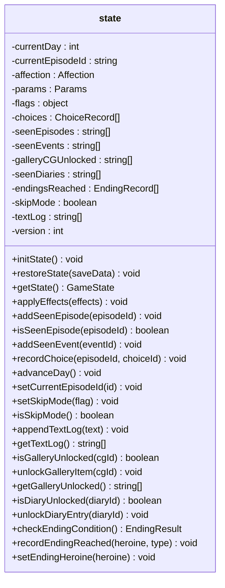

---

### 2.5 storage.js

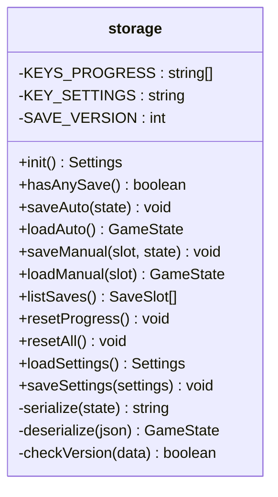

**localStorage キー一覧:**

| キー | 内容 | 削除タイミング |
|------|------|--------------|
| `hokago_signal_autosave` | オートセーブ | resetProgress / resetAll |
| `hokago_signal_save_1` | 手動セーブ1 | resetProgress / resetAll |
| `hokago_signal_save_2` | 手動セーブ2 | resetProgress / resetAll |
| `hokago_signal_save_3` | 手動セーブ3 | resetProgress / resetAll |
| `hokago_signal_settings` | 音量・ミュート設定 | resetAll のみ |

---

### 2.6 dataLoader.js

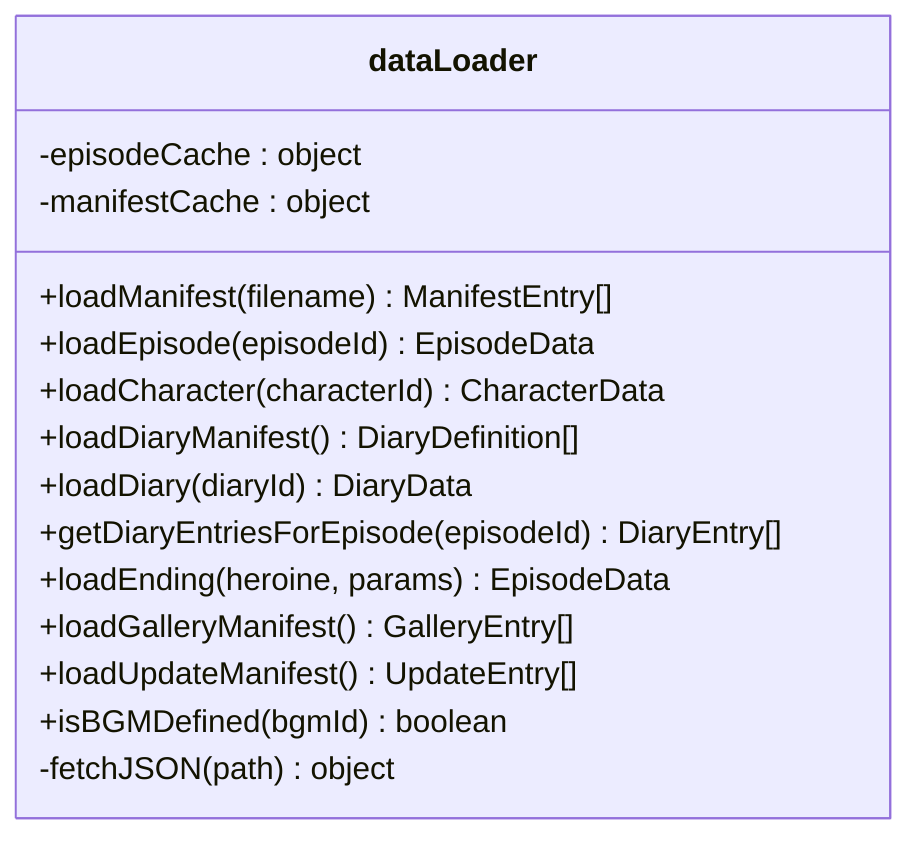

---

### 2.7 audio.js

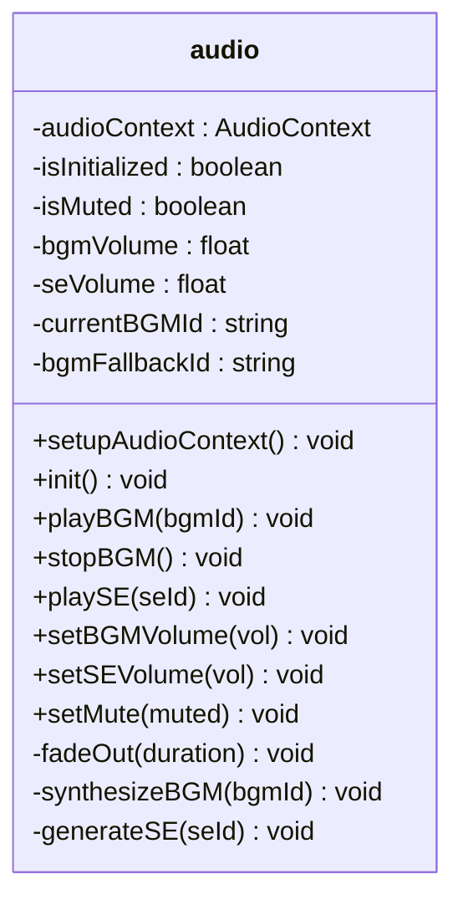

---

## 3. ゲーム状態データクラス

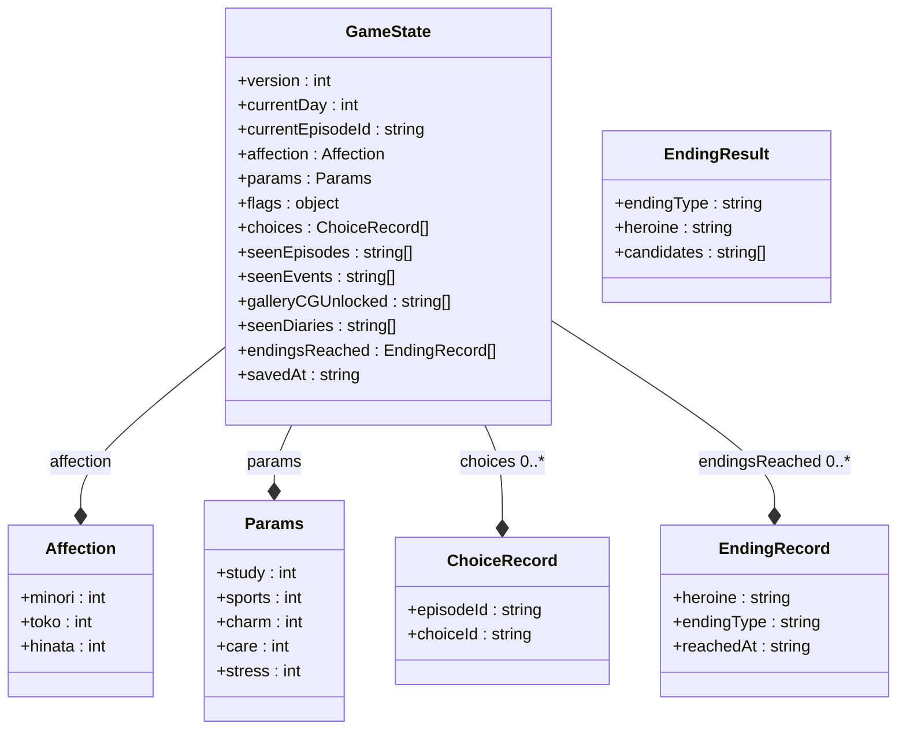

**Params 値域:**

| パラメータ | 初期値 | 範囲 | ヒロイン親和 |
|-----------|--------|------|------------|
| study | 10 | 0〜99 | toko |
| sports | 10 | 0〜99 | hinata |
| charm | 10 | 0〜99 | 共通 |
| care | 10 | 0〜99 | minori |
| stress | 0 | 0〜99 | (負方向) |

---

## 4. エピソードデータクラス

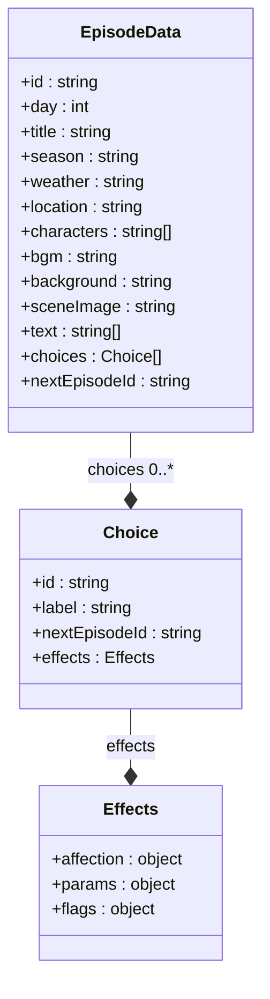

**episodeId 命名規則:**

| 形式 | 例 | 意味 |
|------|----|------|
| `day-{NNN}` | `day-001` | 通常1日分エピソード |
| `day-{NNN}a` | `day-002a` | 同日分岐 A |
| `day-{NNN}b` | `day-002b` | 同日分岐 B |
| `ending-{heroine}` | `ending-minori` | エンディングエピソード |

---

## 5. セーブ・設定データクラス

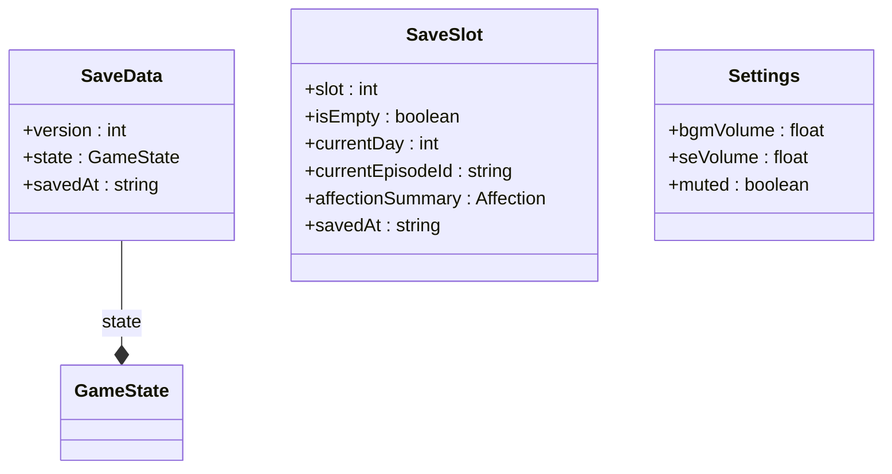

**セーブスロット一覧:**

| スロット | 用途 | 自動操作 |
|---------|------|---------|
| autosave | オートセーブ | エピソード読了・日付更新後 |
| save_1 | 手動スロット1 | プレイヤー操作のみ |
| save_2 | 手動スロット2 | プレイヤー操作のみ |
| save_3 | 手動スロット3 | プレイヤー操作のみ |

---

## 6. マニフェスト・更新履歴データクラス

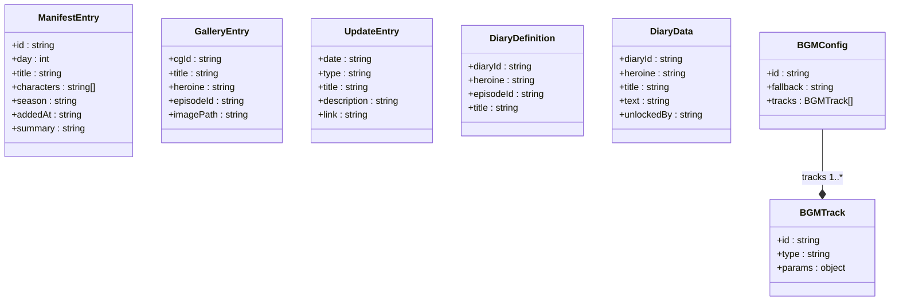

**UpdateEntry.type 値:**

| 値 | 意味 |
|----|------|
| `episode` | 新規エピソード追加 |
| `image` | 新規画像追加 |
| `diary` | 新規日記追加 |
| `event` | 新規イベント追加 |
| `fix` | 重要な不具合修正 |

---

## 7. キャラクターデータクラス

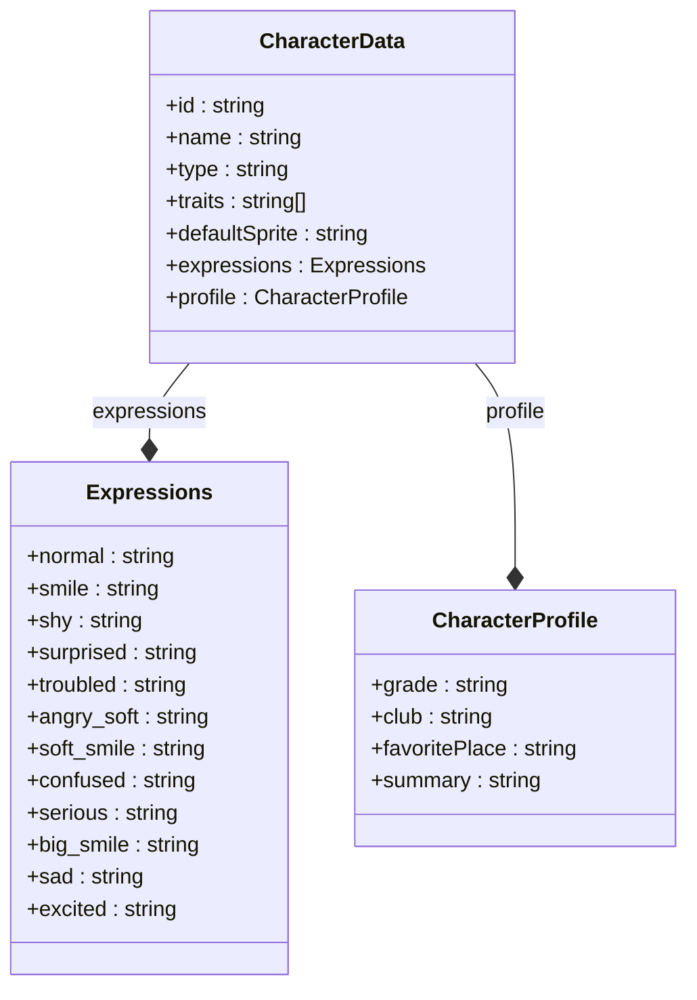

**キャラクター一覧:**

| id | 名前 | 役割 | ホームグラウンド |
|----|------|------|----------------|
| `minori` | 朝倉みのり | 幼なじみ | 通学路・校門・帰り道 |
| `toko` | 白瀬透子 | 才女 | 図書室・窓際・夕方の教室 |
| `hinata` | 夏川ひなた | 元気系 | 校庭・体育館前・公園 |

---

## 8. AI エージェント入出力契約

```mermaid
classDiagram
    direction LR

    class PlannerAgent {
        <<Agent>>
        +input_currentDay : int
        +input_currentEpisodeId : string
        +input_affection : Affection
        +input_params : Params
        +input_flags : object
        +input_recentEpisodes : string[]
        +output : PlannerOutput
        +run() PlannerOutput
    }

    class PlannerOutput {
        +day : int
        +theme : string
        +season : string
        +weather : string
        +location : string
        +featuredHeroine : string
        +supportHeroines : string[]
        +emotionalTone : string
        +episodePurpose : string
        +keyEvent : string
        +choiceDirection : string
        +notesForScenario : string
    }

    class ScenarioAgent {
        <<Agent>>
        +input_plannerOutput : PlannerOutput
        +input_recentEpisodes : string[]
        +input_affection : Affection
        +input_params : Params
        +input_flags : object
        +output : ScenarioIntermediate
        +run() ScenarioIntermediate
    }

    class ScenarioIntermediate {
        <<中間生成物>>
        +episodeId : string
        +day : int
        +title : string
        +summary : string
        +featuredHeroine : string
        +supportHeroines : string[]
        +location : string
        +bgm : string
        +background : string
        +sceneImage : string
        +textBlocks : string[]
        +choices : ScenarioChoice[]
        +nextEpisodeId : string
        +imageRequirements : ImageRequirements
        +writerComment : string
    }

    class ScenarioChoice {
        +id : string
        +label : string
        +intent : string
        +nextEpisodeId : string
        +effects : Effects
    }

    class ImageRequirements {
        +needNewImage : boolean
        +imageType : string
        +characters : string[]
        +location : string
        +timeOfDay : string
        +weather : string
        +emotion : string
        +compositionNote : string
    }

    class ConsistencyAgent {
        <<Agent>>
        +input_episodeJSON : ScenarioIntermediate
        +input_characterData : CharacterData[]
        +input_recentEpisodes : string[]
        +input_flags : object
        +output : ConsistencyResult
        +run() ConsistencyResult
    }

    class ConsistencyResult {
        +passed : boolean
        +issues : ConsistencyIssue[]
        +summary : string
    }

    class ConsistencyIssue {
        +severity : string
        +field : string
        +message : string
        +suggestion : string
    }

    class DataAgent {
        <<Agent>>
        +input_scenarioIntermediate : ScenarioIntermediate
        +input_currentManifest : ManifestEntry[]
        +output : DataAgentOutput
        +run() DataAgentOutput
    }

    class DataAgentOutput {
        +validatedEpisode : EpisodeData
        +updatedManifest : ManifestEntry[]
        +updatedUpdatesJson : UpdateEntry[]
        +validationErrors : string[]
        +summary : string
    }

    class PublisherAgent {
        <<Agent>>
        +input_episodeData : EpisodeData
        +input_manifestFiles : object
        +input_imageFiles : string[]
        +output : PublisherResult
        +run() PublisherResult
    }

    class PublisherResult {
        +status : string
        +stepFailed : string
        +committedFiles : string[]
        +commitHash : string
        +log : string
    }

    PlannerAgent --> PlannerOutput         : generates
    PlannerOutput --> ScenarioAgent        : input
    ScenarioAgent --> ScenarioIntermediate : generates
    ScenarioIntermediate --> ConsistencyAgent : input
    ConsistencyAgent --> ConsistencyResult  : generates
    ConsistencyResult --> ScenarioAgent    : retry if not passed
    ScenarioIntermediate --> DataAgent     : input (after HR approval)
    DataAgent --> DataAgentOutput          : generates
    DataAgentOutput --> PublisherAgent     : input (after HR approval)
    PublisherAgent --> PublisherResult     : generates

    ScenarioIntermediate --* ScenarioChoice    : choices 1..*
    ScenarioIntermediate --* ImageRequirements : imageRequirements
    ConsistencyResult --* ConsistencyIssue     : issues 0..*
```

**Scenario → Data 変換契約:**

| ScenarioIntermediate フィールド | EpisodeData フィールド | 備考 |
|-------------------------------|----------------------|------|
| `episodeId` | `id` | そのまま |
| `textBlocks` | `text` | そのまま |
| `featuredHeroine` + `supportHeroines` | `characters` | 主役先頭で結合 |
| `imageRequirements` | *(除外)* | 制作メタデータ・正式JSONに含めない |
| `writerComment` | *(除外)* | 内部レビュー用・正式JSONに含めない |

---

## 9. 列挙型・定数

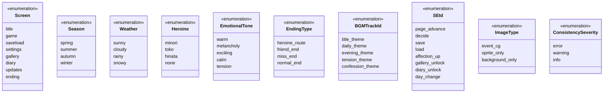

**BGM フォールバック仕様:**

| 状況 | 動作 |
|------|------|
| 指定 BGM が実装済み | その BGM を再生 |
| 指定 BGM が未実装 | `daily_theme` にフォールバック |
| MVP 必須実装 | `title_theme` / `daily_theme` の2曲 |
| MVP 任意 | `evening_theme` / `tension_theme` / `confession_theme` |
