# 放課後シグナル シーケンス図

Version: 1.0
Last Updated: 2026-03-10

---

## 目次

1. [アプリ起動・初期化](#1-アプリ起動初期化)
2. [タイトル画面表示](#2-タイトル画面表示)
3. [最初からゲーム開始](#3-最初からゲーム開始)
4. [続きから再開](#4-続きから再開)
5. [エピソード進行・選択肢フロー](#5-エピソード進行選択肢フロー)
6. [分岐エピソード遷移](#6-分岐エピソード遷移)
7. [オートセーブ](#7-オートセーブ)
8. [手動セーブ](#8-手動セーブ)
9. [手動ロード](#9-手動ロード)
10. [最初からリセット](#10-最初からリセット)
11. [全データ削除](#11-全データ削除)
12. [ギャラリー閲覧](#12-ギャラリー閲覧)
13. [日記閲覧](#13-日記閲覧)
14. [更新履歴・閲覧モード](#14-更新履歴閲覧モード)
15. [設定変更・音量調整](#15-設定変更音量調整)
16. [BGM初期化・再生切替](#16-bgm初期化再生切替)
17. [エラーハンドリング: JSON読み込み失敗](#17-エラーハンドリング-json読み込み失敗)
18. [エラーハンドリング: セーブデータ破損](#18-エラーハンドリング-セーブデータ破損)
19. [エラーハンドリング: 画像読み込み失敗](#19-エラーハンドリング-画像読み込み失敗)
20. [エラーハンドリング: 音声初期化失敗](#20-エラーハンドリング-音声初期化失敗)
21. [AI更新パイプライン（正常系）](#21-ai更新パイプライン正常系)
22. [AI更新パイプライン（失敗系）](#22-ai更新パイプライン失敗系)
23. [Consistency Agent 差し戻し](#23-consistency-agent-差し戻し)
24. [既読スキップ](#24-既読スキップ)
25. [テキストログ（バックログ）表示](#25-テキストログバックログ表示)
26. [ギャラリー解放トリガー](#26-ギャラリー解放トリガー)
27. [日記解放トリガー](#27-日記解放トリガー)
28. [エンディング判定（Day 30 完了時）](#28-エンディング判定day-30-完了時)

---

## 1. アプリ起動・初期化

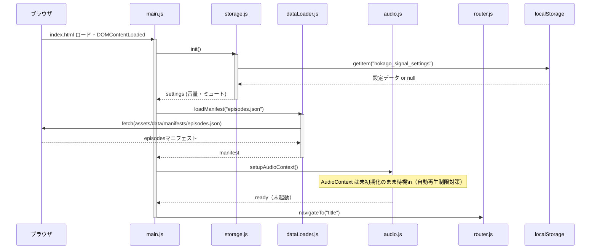
```mermaid
sequenceDiagram
    participant B as ブラウザ
    participant M as main.js
    participant S as storage.js
    participant DL as dataLoader.js
    participant AU as audio.js
    participant R as router.js
    participant LS as localStorage

    B->>M: index.html ロード・DOMContentLoaded
    activate M
    M->>S: init()
    activate S
    S->>LS: getItem("hokago_signal_settings")
    LS-->>S: 設定データ or null
    S-->>M: settings (音量・ミュート)
    deactivate S

    M->>DL: loadManifest("episodes.json")
    activate DL
    DL->>B: fetch(assets/data/manifests/episodes.json)
    B-->>DL: episodesマニフェスト
    DL-->>M: manifest
    deactivate DL

    M->>AU: setupAudioContext()
    Note over AU: AudioContext は未初期化のまま待機\n（自動再生制限対策）
    AU-->>M: ready（未起動）

    M->>R: navigateTo("title")
    deactivate M
```

---

## 2. タイトル画面表示

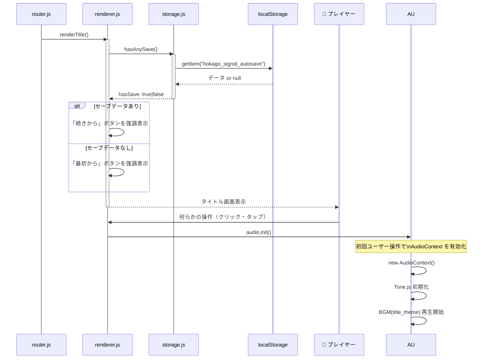
```mermaid
sequenceDiagram
    participant R as router.js
    participant RE as renderer.js
    participant S as storage.js
    participant LS as localStorage
    participant P as 👤 プレイヤー

    R->>RE: renderTitle()
    activate RE
    RE->>S: hasAnySave()
    activate S
    S->>LS: getItem("hokago_signal_autosave")
    LS-->>S: データ or null
    S-->>RE: hasSave: true|false
    deactivate S

    alt セーブデータあり
        RE->>RE: 「続きから」ボタンを強調表示
    else セーブデータなし
        RE->>RE: 「最初から」ボタンを強調表示
    end

    RE-->>P: タイトル画面表示
    deactivate RE

    P->>RE: 何らかの操作（クリック・タップ）
    RE->>AU: audio.init()
    Note over AU: 初回ユーザー操作で\nAudioContext を有効化
    AU->>AU: new AudioContext()
    AU->>AU: Tone.js 初期化
    AU->>AU: BGM(title_theme) 再生開始
```

---

## 3. 最初からゲーム開始

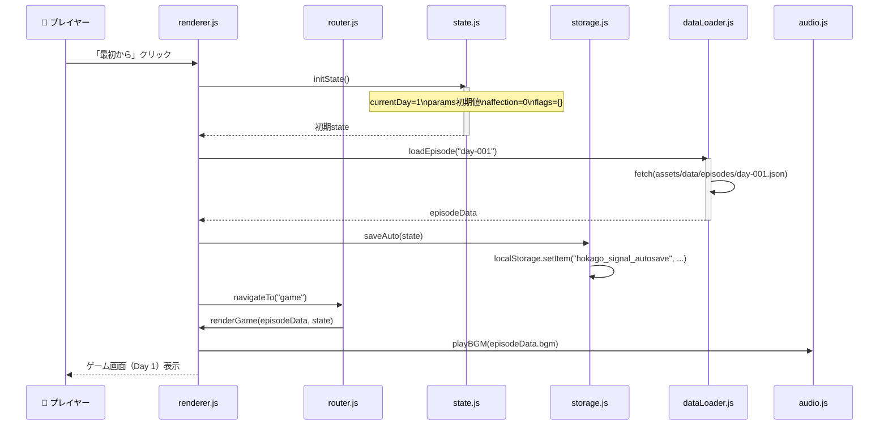
```mermaid
sequenceDiagram
    participant P as 👤 プレイヤー
    participant RE as renderer.js
    participant R as router.js
    participant ST as state.js
    participant S as storage.js
    participant DL as dataLoader.js
    participant AU as audio.js

    P->>RE: 「最初から」クリック
    RE->>ST: initState()
    activate ST
    Note over ST: currentDay=1\nparams初期値\naffection=0\nflags={}
    ST-->>RE: 初期state
    deactivate ST

    RE->>DL: loadEpisode("day-001")
    activate DL
    DL->>DL: fetch(assets/data/episodes/day-001.json)
    DL-->>RE: episodeData
    deactivate DL

    RE->>S: saveAuto(state)
    S->>S: localStorage.setItem("hokago_signal_autosave", ...)

    RE->>R: navigateTo("game")
    R->>RE: renderGame(episodeData, state)
    RE->>AU: playBGM(episodeData.bgm)
    RE-->>P: ゲーム画面（Day 1）表示
```

---

## 4. 続きから再開

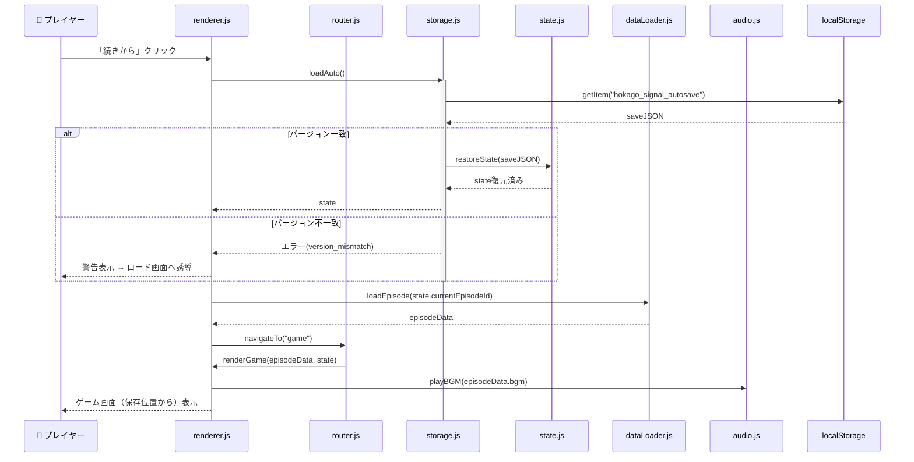
```mermaid
sequenceDiagram
    participant P as 👤 プレイヤー
    participant RE as renderer.js
    participant R as router.js
    participant S as storage.js
    participant ST as state.js
    participant DL as dataLoader.js
    participant AU as audio.js
    participant LS as localStorage

    P->>RE: 「続きから」クリック
    RE->>S: loadAuto()
    activate S
    S->>LS: getItem("hokago_signal_autosave")
    LS-->>S: saveJSON

    alt バージョン一致
        S->>ST: restoreState(saveJSON)
        ST-->>S: state復元済み
        S-->>RE: state
    else バージョン不一致
        S-->>RE: エラー(version_mismatch)
        RE-->>P: 警告表示 → ロード画面へ誘導
    end
    deactivate S

    RE->>DL: loadEpisode(state.currentEpisodeId)
    DL-->>RE: episodeData

    RE->>R: navigateTo("game")
    R->>RE: renderGame(episodeData, state)
    RE->>AU: playBGM(episodeData.bgm)
    RE-->>P: ゲーム画面（保存位置から）表示
```

---

## 5. エピソード進行・選択肢フロー

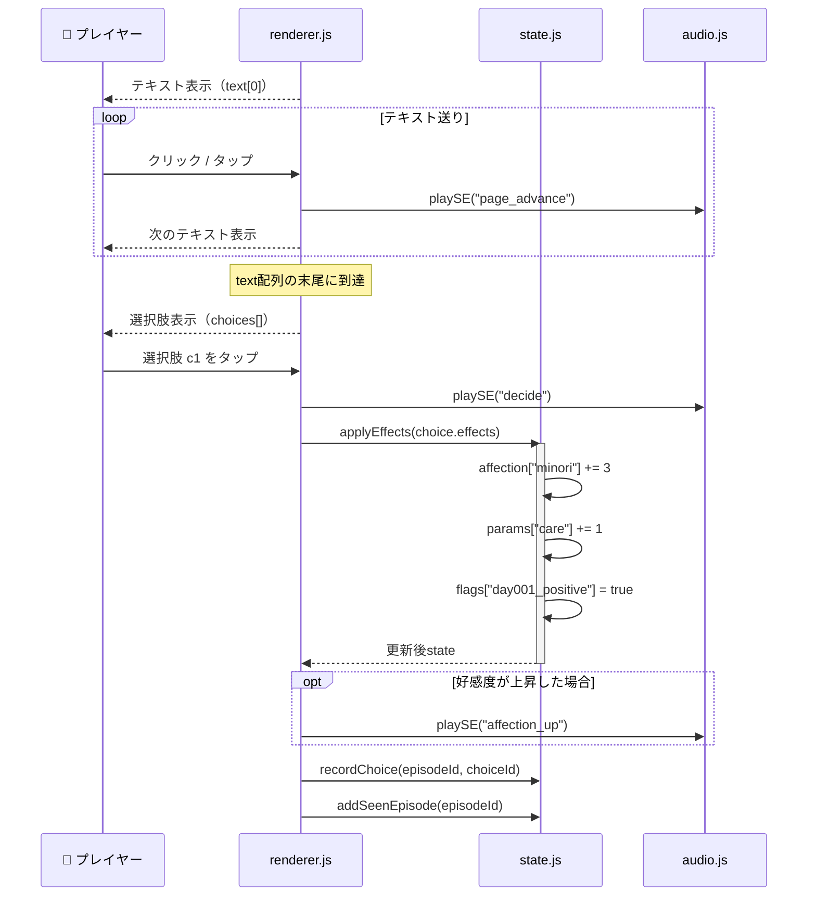
```mermaid
sequenceDiagram
    participant P as 👤 プレイヤー
    participant RE as renderer.js
    participant ST as state.js
    participant AU as audio.js

    RE-->>P: テキスト表示（text[0]）

    loop テキスト送り
        P->>RE: クリック / タップ
        RE->>AU: playSE("page_advance")
        RE-->>P: 次のテキスト表示
    end

    Note over RE: text配列の末尾に到達

    RE-->>P: 選択肢表示（choices[]）

    P->>RE: 選択肢 c1 をタップ
    RE->>AU: playSE("decide")
    RE->>ST: applyEffects(choice.effects)
    activate ST
    ST->>ST: affection["minori"] += 3
    ST->>ST: params["care"] += 1
    ST->>ST: flags["day001_positive"] = true
    ST-->>RE: 更新後state
    deactivate ST

    opt 好感度が上昇した場合
        RE->>AU: playSE("affection_up")
    end

    RE->>ST: recordChoice(episodeId, choiceId)
    RE->>ST: addSeenEpisode(episodeId)
```

---

## 6. 分岐エピソード遷移

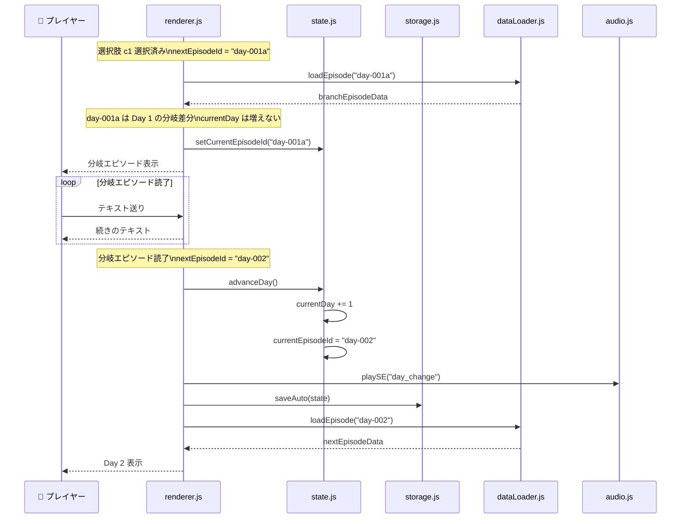
```mermaid
sequenceDiagram
    participant P as 👤 プレイヤー
    participant RE as renderer.js
    participant ST as state.js
    participant S as storage.js
    participant DL as dataLoader.js
    participant AU as audio.js

    Note over RE: 選択肢 c1 選択済み\nnextEpisodeId = "day-001a"

    RE->>DL: loadEpisode("day-001a")
    DL-->>RE: branchEpisodeData
    Note over RE: day-001a は Day 1 の分岐差分\ncurrentDay は増えない

    RE->>ST: setCurrentEpisodeId("day-001a")
    RE-->>P: 分岐エピソード表示

    loop 分岐エピソード読了
        P->>RE: テキスト送り
        RE-->>P: 続きのテキスト
    end

    Note over RE: 分岐エピソード読了\nnextEpisodeId = "day-002"

    RE->>ST: advanceDay()
    ST->>ST: currentDay += 1
    ST->>ST: currentEpisodeId = "day-002"

    RE->>AU: playSE("day_change")
    RE->>S: saveAuto(state)

    RE->>DL: loadEpisode("day-002")
    DL-->>RE: nextEpisodeData
    RE-->>P: Day 2 表示
```

---

## 7. オートセーブ

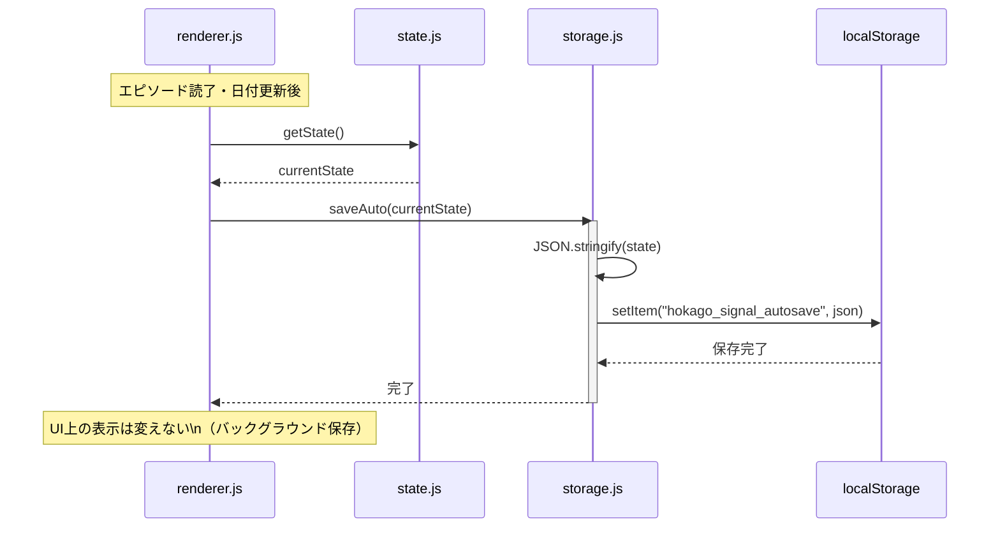
```mermaid
sequenceDiagram
    participant RE as renderer.js
    participant ST as state.js
    participant S as storage.js
    participant LS as localStorage

    Note over RE: エピソード読了・日付更新後

    RE->>ST: getState()
    ST-->>RE: currentState

    RE->>S: saveAuto(currentState)
    activate S
    S->>S: JSON.stringify(state)
    S->>LS: setItem("hokago_signal_autosave", json)
    LS-->>S: 保存完了
    S-->>RE: 完了
    deactivate S

    Note over RE: UI上の表示は変えない\n（バックグラウンド保存）
```

---

## 8. 手動セーブ

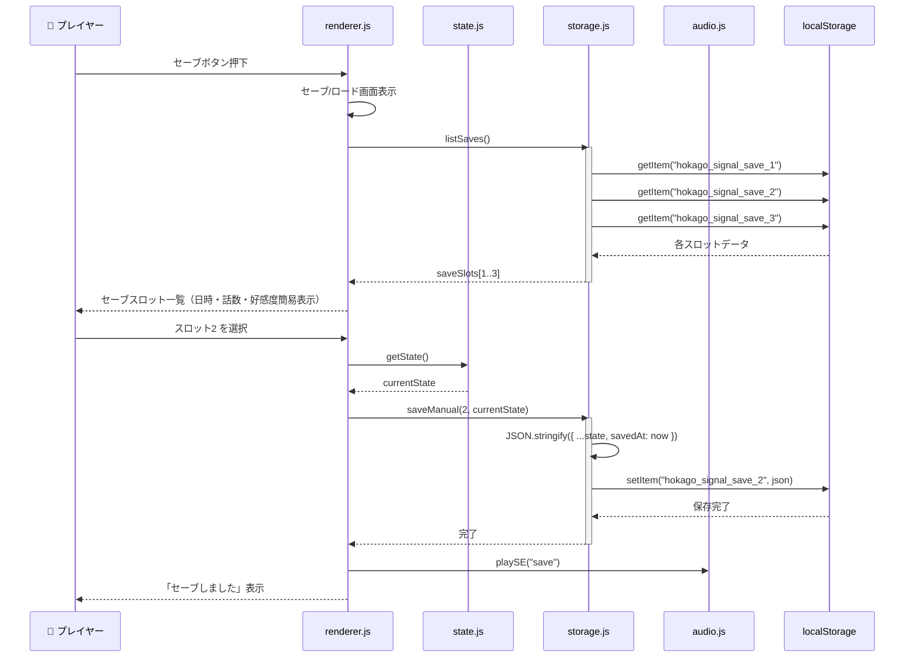
```mermaid
sequenceDiagram
    participant P as 👤 プレイヤー
    participant RE as renderer.js
    participant ST as state.js
    participant S as storage.js
    participant AU as audio.js
    participant LS as localStorage

    P->>RE: セーブボタン押下
    RE->>RE: セーブ/ロード画面表示

    RE->>S: listSaves()
    activate S
    S->>LS: getItem("hokago_signal_save_1")
    S->>LS: getItem("hokago_signal_save_2")
    S->>LS: getItem("hokago_signal_save_3")
    LS-->>S: 各スロットデータ
    S-->>RE: saveSlots[1..3]
    deactivate S

    RE-->>P: セーブスロット一覧（日時・話数・好感度簡易表示）

    P->>RE: スロット2 を選択
    RE->>ST: getState()
    ST-->>RE: currentState

    RE->>S: saveManual(2, currentState)
    activate S
    S->>S: JSON.stringify({ ...state, savedAt: now })
    S->>LS: setItem("hokago_signal_save_2", json)
    LS-->>S: 保存完了
    S-->>RE: 完了
    deactivate S

    RE->>AU: playSE("save")
    RE-->>P: 「セーブしました」表示
```

---

## 9. 手動ロード

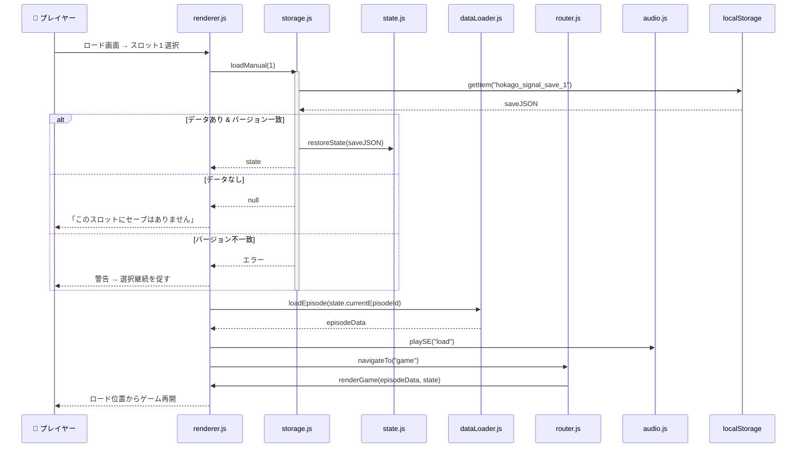
```mermaid
sequenceDiagram
    participant P as 👤 プレイヤー
    participant RE as renderer.js
    participant S as storage.js
    participant ST as state.js
    participant DL as dataLoader.js
    participant R as router.js
    participant AU as audio.js
    participant LS as localStorage

    P->>RE: ロード画面 → スロット1 選択
    RE->>S: loadManual(1)
    activate S
    S->>LS: getItem("hokago_signal_save_1")
    LS-->>S: saveJSON

    alt データあり & バージョン一致
        S->>ST: restoreState(saveJSON)
        S-->>RE: state
    else データなし
        S-->>RE: null
        RE-->>P: 「このスロットにセーブはありません」
    else バージョン不一致
        S-->>RE: エラー
        RE-->>P: 警告 → 選択継続を促す
    end
    deactivate S

    RE->>DL: loadEpisode(state.currentEpisodeId)
    DL-->>RE: episodeData

    RE->>AU: playSE("load")
    RE->>R: navigateTo("game")
    R->>RE: renderGame(episodeData, state)
    RE-->>P: ロード位置からゲーム再開
```

---

## 10. 最初からリセット

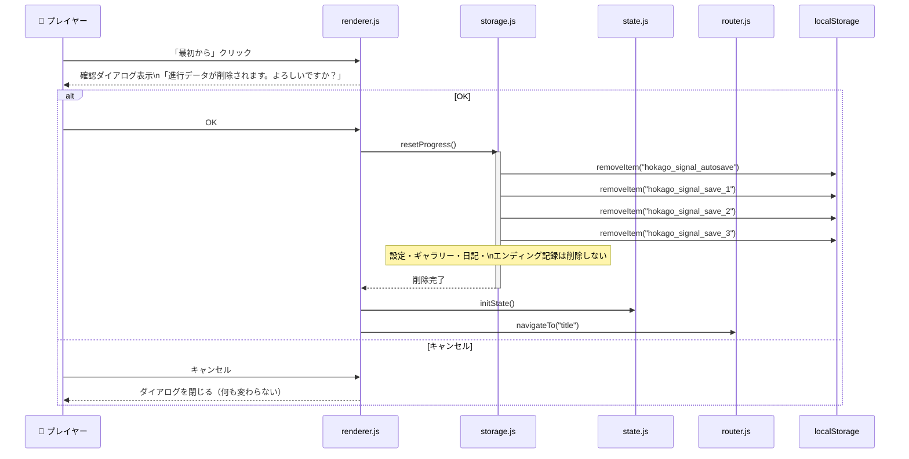
```mermaid
sequenceDiagram
    participant P as 👤 プレイヤー
    participant RE as renderer.js
    participant S as storage.js
    participant ST as state.js
    participant R as router.js
    participant LS as localStorage

    P->>RE: 「最初から」クリック
    RE-->>P: 確認ダイアログ表示\n「進行データが削除されます。よろしいですか？」

    alt OK
        P->>RE: OK
        RE->>S: resetProgress()
        activate S
        S->>LS: removeItem("hokago_signal_autosave")
        S->>LS: removeItem("hokago_signal_save_1")
        S->>LS: removeItem("hokago_signal_save_2")
        S->>LS: removeItem("hokago_signal_save_3")
        Note over S: 設定・ギャラリー・日記・\nエンディング記録は削除しない
        S-->>RE: 削除完了
        deactivate S

        RE->>ST: initState()
        RE->>R: navigateTo("title")
    else キャンセル
        P->>RE: キャンセル
        RE-->>P: ダイアログを閉じる（何も変わらない）
    end
```

---

## 11. 全データ削除

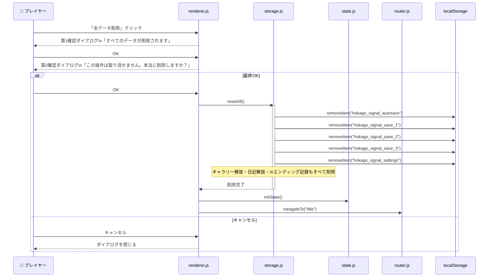
```mermaid
sequenceDiagram
    participant P as 👤 プレイヤー
    participant RE as renderer.js
    participant S as storage.js
    participant ST as state.js
    participant R as router.js
    participant LS as localStorage

    P->>RE: 「全データ削除」クリック
    RE-->>P: 第1確認ダイアログ\n「すべてのデータが削除されます」

    P->>RE: OK
    RE-->>P: 第2確認ダイアログ\n「この操作は取り消せません。本当に削除しますか？」

    alt 最終OK
        P->>RE: OK
        RE->>S: resetAll()
        activate S
        S->>LS: removeItem("hokago_signal_autosave")
        S->>LS: removeItem("hokago_signal_save_1")
        S->>LS: removeItem("hokago_signal_save_2")
        S->>LS: removeItem("hokago_signal_save_3")
        S->>LS: removeItem("hokago_signal_settings")
        Note over S: ギャラリー解放・日記解放・\nエンディング記録もすべて削除
        S-->>RE: 削除完了
        deactivate S

        RE->>ST: initState()
        RE->>R: navigateTo("title")
    else キャンセル
        P->>RE: キャンセル
        RE-->>P: ダイアログを閉じる
    end
```

---

## 12. ギャラリー閲覧

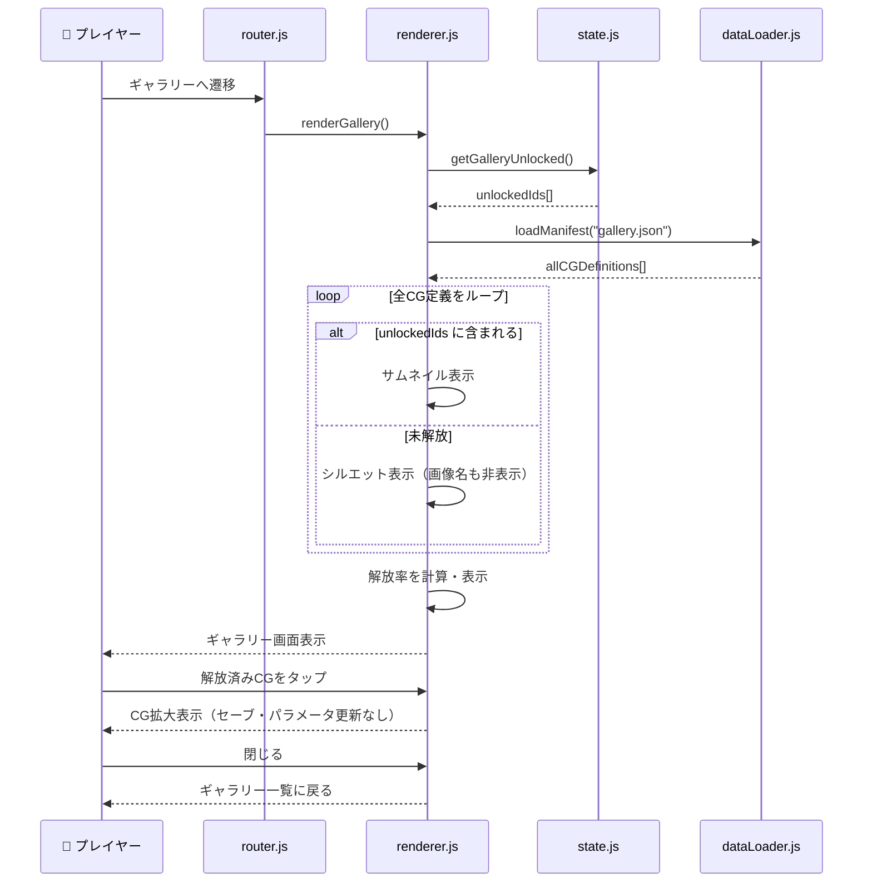
```mermaid
sequenceDiagram
    participant P as 👤 プレイヤー
    participant R as router.js
    participant RE as renderer.js
    participant ST as state.js
    participant DL as dataLoader.js

    P->>R: ギャラリーへ遷移
    R->>RE: renderGallery()

    RE->>ST: getGalleryUnlocked()
    ST-->>RE: unlockedIds[]

    RE->>DL: loadManifest("gallery.json")
    DL-->>RE: allCGDefinitions[]

    loop 全CG定義をループ
        alt unlockedIds に含まれる
            RE->>RE: サムネイル表示
        else 未解放
            RE->>RE: シルエット表示（画像名も非表示）
        end
    end

    RE->>RE: 解放率を計算・表示
    RE-->>P: ギャラリー画面表示

    P->>RE: 解放済みCGをタップ
    RE-->>P: CG拡大表示（セーブ・パラメータ更新なし）

    P->>RE: 閉じる
    RE-->>P: ギャラリー一覧に戻る
```

---

## 13. 日記閲覧

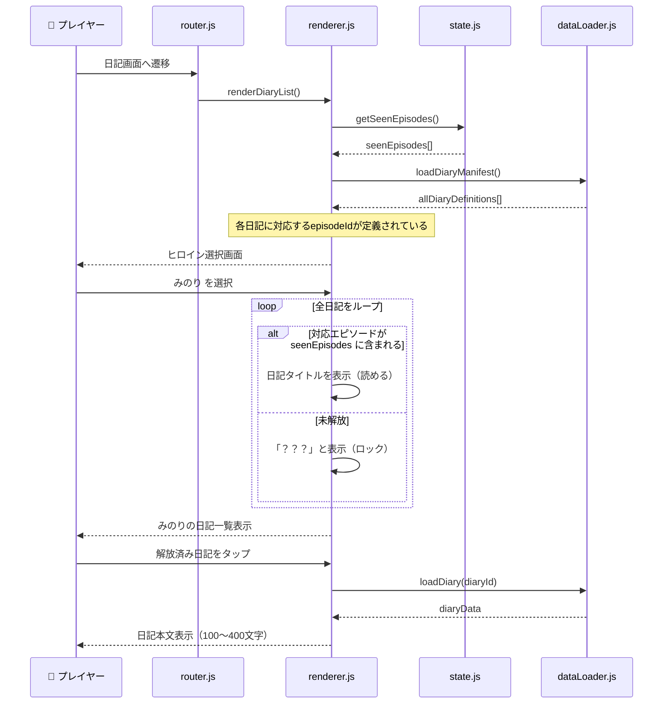
```mermaid
sequenceDiagram
    participant P as 👤 プレイヤー
    participant R as router.js
    participant RE as renderer.js
    participant ST as state.js
    participant DL as dataLoader.js

    P->>R: 日記画面へ遷移
    R->>RE: renderDiaryList()

    RE->>ST: getSeenEpisodes()
    ST-->>RE: seenEpisodes[]

    RE->>DL: loadDiaryManifest()
    DL-->>RE: allDiaryDefinitions[]
    Note over RE: 各日記に対応するepisodeIdが定義されている

    RE-->>P: ヒロイン選択画面

    P->>RE: みのり を選択

    loop 全日記をループ
        alt 対応エピソードが seenEpisodes に含まれる
            RE->>RE: 日記タイトルを表示（読める）
        else 未解放
            RE->>RE: 「？？？」と表示（ロック）
        end
    end

    RE-->>P: みのりの日記一覧表示

    P->>RE: 解放済み日記をタップ
    RE->>DL: loadDiary(diaryId)
    DL-->>RE: diaryData
    RE-->>P: 日記本文表示（100〜400文字）
```

---

## 14. 更新履歴・閲覧モード

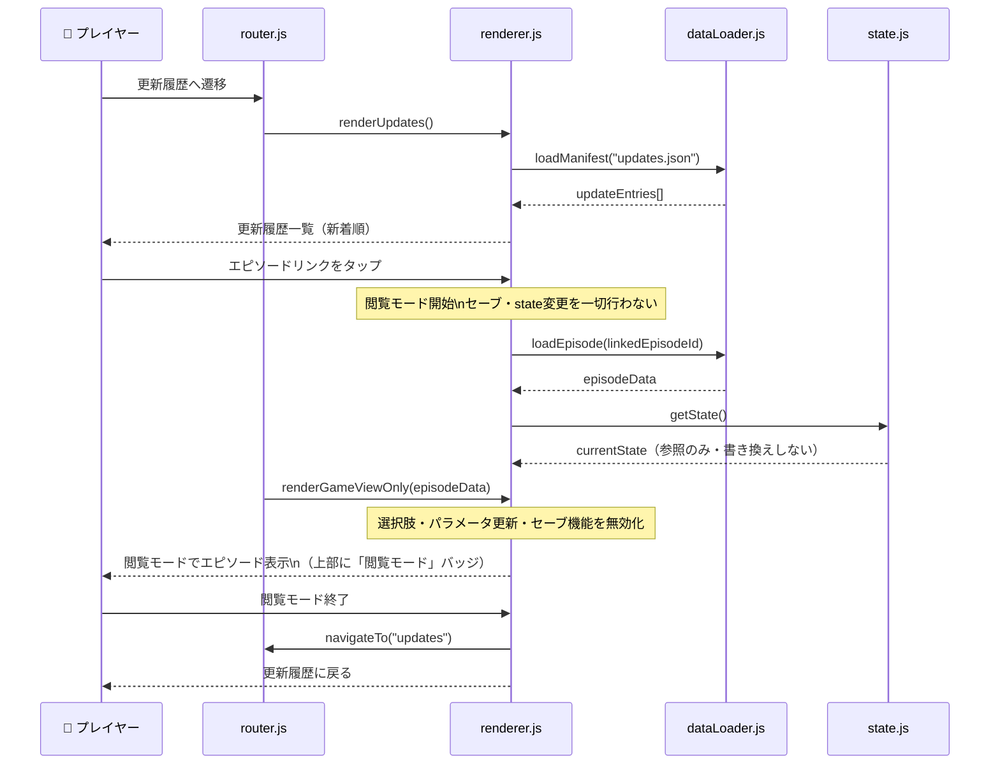
```mermaid
sequenceDiagram
    participant P as 👤 プレイヤー
    participant R as router.js
    participant RE as renderer.js
    participant DL as dataLoader.js
    participant ST as state.js

    P->>R: 更新履歴へ遷移
    R->>RE: renderUpdates()

    RE->>DL: loadManifest("updates.json")
    DL-->>RE: updateEntries[]
    RE-->>P: 更新履歴一覧（新着順）

    P->>RE: エピソードリンクをタップ
    Note over RE: 閲覧モード開始\nセーブ・state変更を一切行わない

    RE->>DL: loadEpisode(linkedEpisodeId)
    DL-->>RE: episodeData

    RE->>ST: getState()
    ST-->>RE: currentState（参照のみ・書き換えしない）

    R->>RE: renderGameViewOnly(episodeData)
    Note over RE: 選択肢・パラメータ更新・セーブ機能を無効化
    RE-->>P: 閲覧モードでエピソード表示\n（上部に「閲覧モード」バッジ）

    P->>RE: 閲覧モード終了
    RE->>R: navigateTo("updates")
    RE-->>P: 更新履歴に戻る
```

---

## 15. 設定変更・音量調整

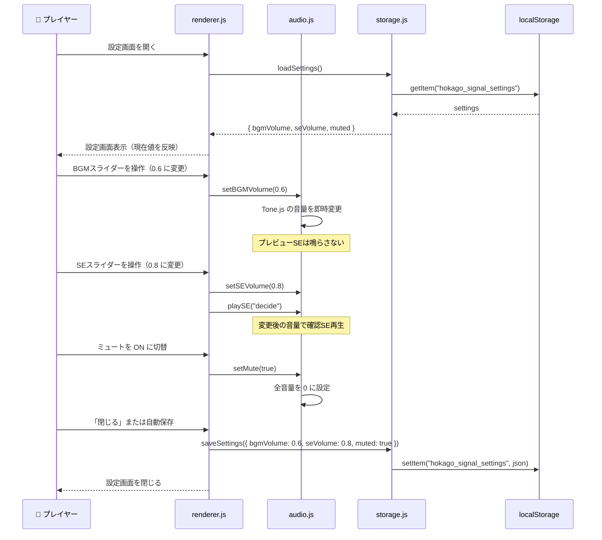
```mermaid
sequenceDiagram
    participant P as 👤 プレイヤー
    participant RE as renderer.js
    participant AU as audio.js
    participant S as storage.js
    participant LS as localStorage

    P->>RE: 設定画面を開く
    RE->>S: loadSettings()
    S->>LS: getItem("hokago_signal_settings")
    LS-->>S: settings
    S-->>RE: { bgmVolume, seVolume, muted }
    RE-->>P: 設定画面表示（現在値を反映）

    P->>RE: BGMスライダーを操作（0.6 に変更）
    RE->>AU: setBGMVolume(0.6)
    AU->>AU: Tone.js の音量を即時変更
    Note over AU: プレビューSEは鳴らさない

    P->>RE: SEスライダーを操作（0.8 に変更）
    RE->>AU: setSEVolume(0.8)
    RE->>AU: playSE("decide")
    Note over AU: 変更後の音量で確認SE再生

    P->>RE: ミュートを ON に切替
    RE->>AU: setMute(true)
    AU->>AU: 全音量を 0 に設定

    P->>RE: 「閉じる」または自動保存
    RE->>S: saveSettings({ bgmVolume: 0.6, seVolume: 0.8, muted: true })
    S->>LS: setItem("hokago_signal_settings", json)
    RE-->>P: 設定画面を閉じる
```

---

## 16. BGM初期化・再生切替

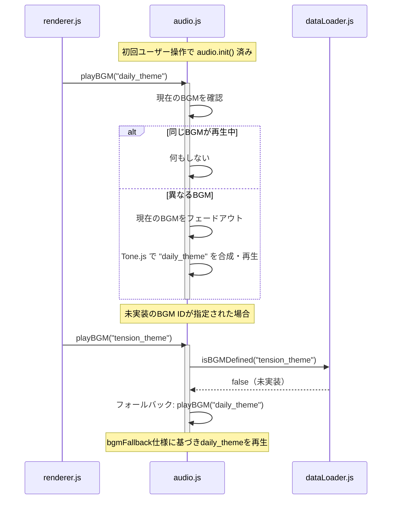
```mermaid
sequenceDiagram
    participant RE as renderer.js
    participant AU as audio.js
    participant DL as dataLoader.js

    Note over AU: 初回ユーザー操作で audio.init() 済み

    RE->>AU: playBGM("daily_theme")
    activate AU
    AU->>AU: 現在のBGMを確認
    alt 同じBGMが再生中
        AU->>AU: 何もしない
    else 異なるBGM
        AU->>AU: 現在のBGMをフェードアウト
        AU->>AU: Tone.js で "daily_theme" を合成・再生
    end
    deactivate AU

    Note over AU: 未実装のBGM IDが指定された場合

    RE->>AU: playBGM("tension_theme")
    activate AU
    AU->>DL: isBGMDefined("tension_theme")
    DL-->>AU: false（未実装）
    AU->>AU: フォールバック: playBGM("daily_theme")
    Note over AU: bgmFallback仕様に基づきdaily_themeを再生
    deactivate AU
```

---

## 17. エラーハンドリング: JSON読み込み失敗

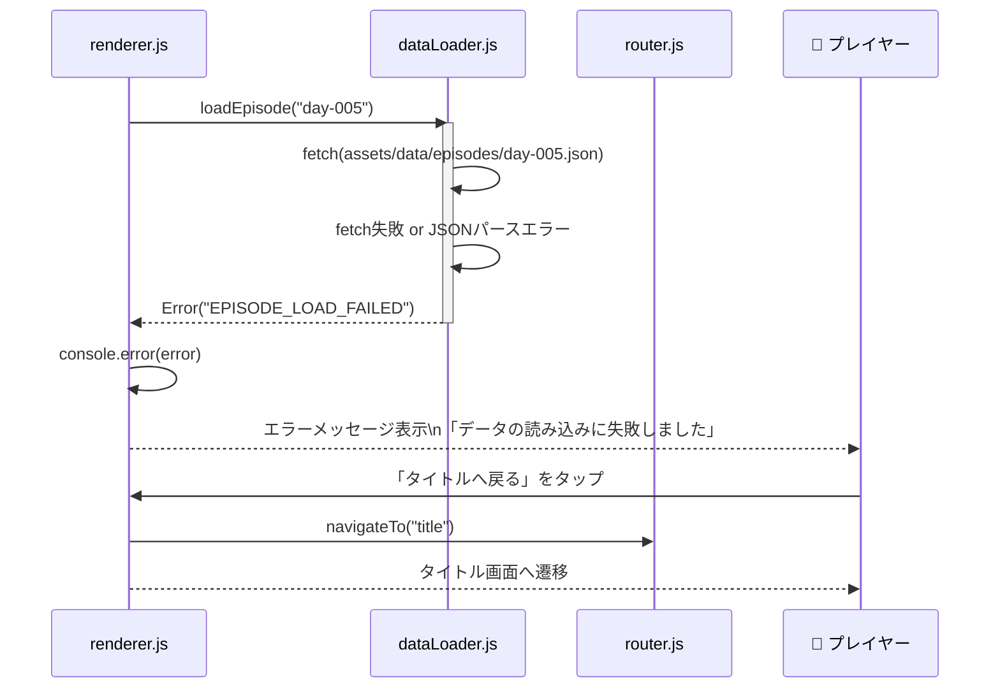
```mermaid
sequenceDiagram
    participant RE as renderer.js
    participant DL as dataLoader.js
    participant R as router.js
    participant P as 👤 プレイヤー

    RE->>DL: loadEpisode("day-005")
    activate DL
    DL->>DL: fetch(assets/data/episodes/day-005.json)
    DL->>DL: fetch失敗 or JSONパースエラー
    DL-->>RE: Error("EPISODE_LOAD_FAILED")
    deactivate DL

    RE->>RE: console.error(error)
    RE-->>P: エラーメッセージ表示\n「データの読み込みに失敗しました」

    P->>RE: 「タイトルへ戻る」をタップ
    RE->>R: navigateTo("title")
    RE-->>P: タイトル画面へ遷移
```

---

## 18. エラーハンドリング: セーブデータ破損

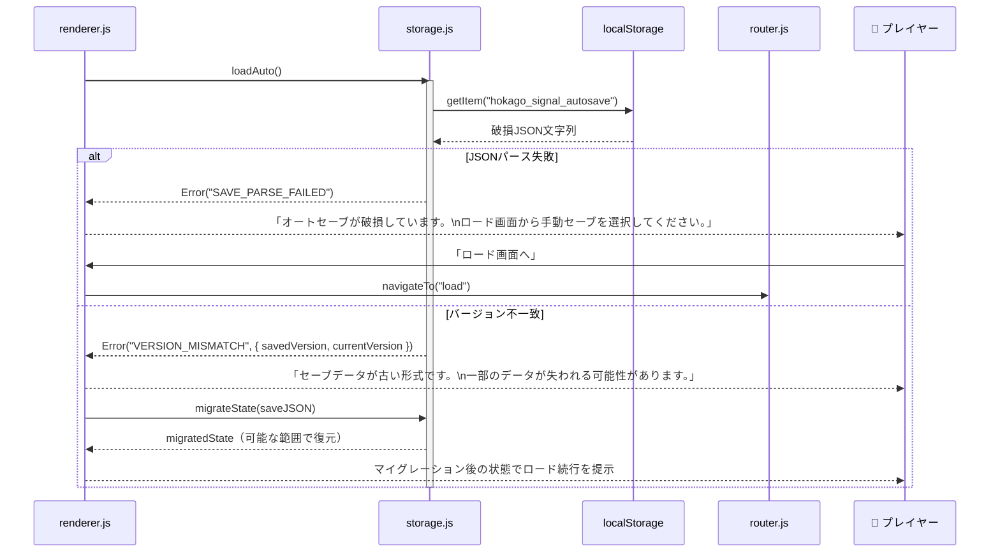
```mermaid
sequenceDiagram
    participant RE as renderer.js
    participant S as storage.js
    participant LS as localStorage
    participant R as router.js
    participant P as 👤 プレイヤー

    RE->>S: loadAuto()
    activate S
    S->>LS: getItem("hokago_signal_autosave")
    LS-->>S: 破損JSON文字列

    alt JSONパース失敗
        S-->>RE: Error("SAVE_PARSE_FAILED")
        RE-->>P: 「オートセーブが破損しています。\nロード画面から手動セーブを選択してください。」
        P->>RE: 「ロード画面へ」
        RE->>R: navigateTo("load")
    else バージョン不一致
        S-->>RE: Error("VERSION_MISMATCH", { savedVersion, currentVersion })
        RE-->>P: 「セーブデータが古い形式です。\n一部のデータが失われる可能性があります。」
        RE->>S: migrateState(saveJSON)
        S-->>RE: migratedState（可能な範囲で復元）
        RE-->>P: マイグレーション後の状態でロード続行を提示
    end
    deactivate S
```

---

## 19. エラーハンドリング: 画像読み込み失敗

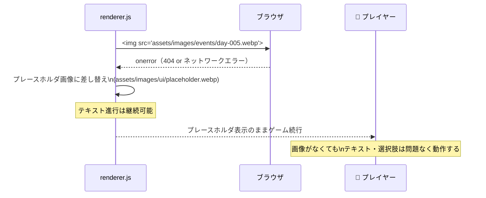
```mermaid
sequenceDiagram
    participant RE as renderer.js
    participant B as ブラウザ
    participant P as 👤 プレイヤー

    RE->>B: <img src="assets/images/events/day-005.webp">
    B-->>RE: onerror（404 or ネットワークエラー）

    RE->>RE: プレースホルダ画像に差し替え\n(assets/images/ui/placeholder.webp)
    Note over RE: テキスト進行は継続可能

    RE-->>P: プレースホルダ表示のままゲーム続行
    Note over P: 画像がなくても\nテキスト・選択肢は問題なく動作する
```

---

## 20. エラーハンドリング: 音声初期化失敗

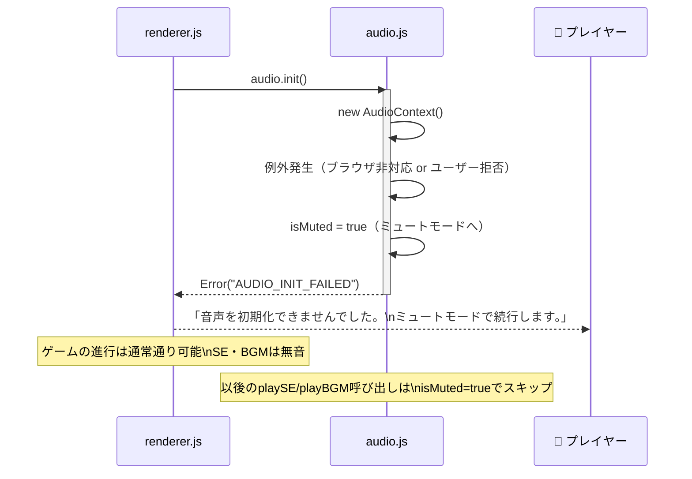
```mermaid
sequenceDiagram
    participant RE as renderer.js
    participant AU as audio.js
    participant P as 👤 プレイヤー

    RE->>AU: audio.init()
    activate AU
    AU->>AU: new AudioContext()
    AU->>AU: 例外発生（ブラウザ非対応 or ユーザー拒否）
    AU->>AU: isMuted = true（ミュートモードへ）
    AU-->>RE: Error("AUDIO_INIT_FAILED")
    deactivate AU

    RE-->>P: 「音声を初期化できませんでした。\nミュートモードで続行します。」
    Note over RE: ゲームの進行は通常通り可能\nSE・BGMは無音

    Note over AU: 以後のplaySE/playBGM呼び出しは\nisMuted=trueでスキップ
```

---

## 21. AI更新パイプライン（正常系）

```mermaid
sequenceDiagram
    participant CR as ⏰ OpenClaw/cron
    participant PL as Planner Agent
    participant SC as Scenario Agent
    participant IM as Image Prompt Agent
    participant CO as Consistency Agent
    participant HR as 👤 人間レビュアー
    participant DA as Data Agent
    participant PB as Publisher Agent
    participant GH as GitHub Pages

    CR->>PL: 起動（毎日 05:00）
    activate PL
    PL->>PL: 現在の state・最近3話・\nフラグ情報を読み込む
    PL->>PL: 次話企画JSON を生成
    PL-->>SC: 企画JSON（day/theme/heroine/tone/...）
    deactivate PL

    activate SC
    SC->>SC: キャラ設定・文体サンプルを参照
    SC->>SC: エピソードJSON を生成
    SC-->>CO: エピソードJSON + キャラ設定
    deactivate SC

    activate CO
    CO->>CO: 口調・設定・フラグ整合性を検査
    CO-->>SC: passed: true
    deactivate CO

    SC-->>IM: エピソードJSON（確定）
    activate IM
    IM->>IM: 場面・キャラ情報からプロンプト生成
    IM-->>HR: 画像プロンプト（英語）
    deactivate IM

    activate HR
    HR->>HR: AI画像生成ツールでイラスト生成
    HR->>HR: 画像品質・キャラ一致を確認
    HR-->>DA: 採用画像ファイル + エピソードJSON
    deactivate HR

    activate DA
    DA->>DA: JSON フォーマット検証・整形
    DA->>DA: ID重複チェック
    DA->>DA: episodes.json マニフェスト更新
    DA-->>HR: 整形済みファイル一式
    deactivate DA

    activate HR
    HR->>HR: 最終確認（セリフ・流れ・画像）
    HR-->>PB: 承認・公開指示
    deactivate HR

    activate PB
    PB->>PB: git add（変更ファイル）
    PB->>PB: git commit
    PB->>PB: git push origin main
    PB->>GH: GitHub Pages 反映確認
    GH-->>PB: 公開完了
    PB->>PB: updates.json に追記
    PB->>PB: 再度 push
    PB-->>CR: 完了ログ保存
    deactivate PB
```

---

## 22. AI更新パイプライン（失敗系）

```mermaid
sequenceDiagram
    participant CR as ⏰ OpenClaw/cron
    participant SC as Scenario Agent
    participant CO as Consistency Agent
    participant HR as 👤 人間レビュアー
    participant DA as Data Agent
    participant PB as Publisher Agent
    participant GH as GitHub Pages

    CR->>SC: 起動
    SC-->>CO: エピソードJSON

    activate CO
    CO->>CO: 整合性検査
    CO-->>SC: passed: false\nissues: [{ severity: "error", ... }]
    deactivate CO

    SC->>SC: 問題箇所を修正して再生成
    SC-->>CO: 修正済みエピソードJSON

    activate CO
    CO-->>SC: passed: true
    deactivate CO

    SC-->>HR: エピソードJSON（確定）

    activate HR
    HR->>HR: 画像生成 → 品質が低い・キャラブレ
    HR-->>HR: 差し戻し（再プロンプト）
    HR->>HR: 再生成 → 採用
    HR-->>DA: 採用ファイル
    deactivate HR

    DA-->>HR: 整形済みファイル一式

    activate HR
    HR->>HR: 最終確認 → セリフに問題あり
    HR-->>SC: 差し戻し（特定箇所の修正指示）
    deactivate HR

    SC->>SC: 修正再生成
    SC-->>HR: 修正版
    HR-->>PB: 最終承認

    activate PB
    PB->>PB: git push
    GH-->>PB: push 失敗（認証エラー等）
    PB->>PB: 処理を中断
    PB->>PB: エラーログを保存
    Note over PB: updates.json は更新しない\n前日の公開状態を維持する
    PB-->>CR: 失敗ログ保存・終了
    deactivate PB

    Note over CR: 翌日のcronで手動リカバリまたは\n再実行を行う
```

---

## 23. Consistency Agent 差し戻し

```mermaid
sequenceDiagram
    participant SC as Scenario Agent
    participant CO as Consistency Agent

    SC-->>CO: エピソードJSON（初稿）

    activate CO
    CO->>CO: 口調チェック\n→ 透子が「〜じゃん」と言っている（NG）
    CO->>CO: 季節チェック → OK
    CO->>CO: フラグチェック\n→ met_toko フラグなしなのに透子が登場（NG）
    CO->>CO: 好感度変化チェック → OK
    CO-->>SC: passed: false\nissues: [\n  { severity:"error", field:"text[2]", message:"透子の口調が設定と不一致" },\n  { severity:"error", field:"characters[0]", message:"met_tokoフラグ未成立" }\n]
    deactivate CO

    activate SC
    SC->>SC: 透子の登場を削除 → みのりに変更
    SC->>SC: 口調を「〜ですよ」に修正
    SC-->>CO: 修正済みJSON
    deactivate SC

    activate CO
    CO->>CO: 再検査 → 全項目クリア
    CO-->>SC: passed: true\nsummary: "問題なし。自然な展開です。"
    deactivate CO
```

---

## 24. 既読スキップ

```mermaid
sequenceDiagram
    participant P as 👤 プレイヤー
    participant RE as renderer.js
    participant ST as state.js
    participant AU as audio.js

    P->>RE: スキップボタン押下（長押し or 専用ボタン）
    RE->>ST: setSkipMode(true)

    loop 自動テキスト送り
        RE->>ST: isSeenEpisode(currentEpisodeId)

        alt 既読エピソード内のテキスト
            RE->>AU: playSE("page_advance") ※音量低め or なし
            RE->>RE: 次のテキストブロックへ高速送り
        else 未読テキストブロックに到達
            RE->>ST: setSkipMode(false)
            RE-->>P: スキップ停止・通常表示に戻す
        end

        alt 選択肢に到達
            RE->>ST: setSkipMode(false)
            RE-->>P: スキップ停止・選択肢を表示
        end
    end

    opt スキップボタン再押下（途中キャンセル）
        P->>RE: スキップ解除
        RE->>ST: setSkipMode(false)
        RE-->>P: 現在テキストで通常表示
    end
```

> **未確定事項:** SQ1 参照（QandA.md）

---

## 25. テキストログ（バックログ）表示

```mermaid
sequenceDiagram
    participant P as 👤 プレイヤー
    participant RE as renderer.js
    participant ST as state.js

    P->>RE: ログボタン押下 or 上スワイプ
    RE->>ST: getTextLog()
    ST-->>RE: textLog[]（直近 N 件のテキストブロック）

    RE-->>P: ログパネルをオーバーレイ表示\n（最新テキストを下端に表示）

    loop スクロール操作
        P->>RE: 上スクロール
        RE-->>P: 過去のテキストを表示
    end

    P->>RE: 「閉じる」またはバックジェスチャー
    RE-->>P: ログパネルを閉じてゲーム画面に戻る

    Note over RE: ゲーム状態・seenEpisodes は変化しない
```

> **未確定事項:** SQ2 参照（QandA.md）

---

## 26. ギャラリー解放トリガー

```mermaid
sequenceDiagram
    participant RE as renderer.js
    participant ST as state.js
    participant S as storage.js
    participant AU as audio.js
    participant P as 👤 プレイヤー

    Note over RE: エピソード中 sceneImage の初回表示時

    RE->>RE: sceneImage をレンダリング
    RE->>ST: isGalleryUnlocked(cgId)
    ST-->>RE: false（未解放）

    RE->>ST: unlockGalleryItem(cgId)
    activate ST
    ST->>ST: galleryCGUnlocked.add(cgId)
    ST-->>RE: 解放完了
    deactivate ST

    RE->>AU: playSE("gallery_unlock")
    RE-->>P: 「CG解放」通知を小さく表示\n（ゲーム進行を妨げない）

    RE->>S: saveAuto(state)
    Note over S: ギャラリー解放状態を localStorage に保存
```

> **未確定事項:** SQ4 参照（QandA.md）

---

## 27. 日記解放トリガー

```mermaid
sequenceDiagram
    participant RE as renderer.js
    participant ST as state.js
    participant DL as dataLoader.js
    participant S as storage.js
    participant AU as audio.js
    participant P as 👤 プレイヤー

    Note over RE: エピソード読了・選択肢確定後

    RE->>ST: addSeenEpisode(episodeId)
    activate ST
    ST->>ST: seenEpisodes.add(episodeId)
    deactivate ST

    RE->>DL: getDiaryEntriesForEpisode(episodeId)
    DL-->>RE: diaryEntries[]（この話に対応する日記エントリ一覧）

    loop 対応日記エントリをループ
        RE->>ST: isDiaryUnlocked(diaryId)
        ST-->>RE: false（未解放）
        RE->>ST: unlockDiaryEntry(diaryId)
        ST->>ST: seenDiaries.add(diaryId)
    end

    alt 新規日記が1件以上解放された
        RE->>AU: playSE("diary_unlock")
        RE-->>P: 「日記が追加されました」通知
    end

    RE->>S: saveAuto(state)
```

---

## 28. エンディング判定（Day 30 完了時）

```mermaid
sequenceDiagram
    participant RE as renderer.js
    participant ST as state.js
    participant DL as dataLoader.js
    participant AU as audio.js
    participant S as storage.js
    participant P as 👤 プレイヤー

    Note over RE: Day 30 最終エピソード読了後

    RE->>ST: checkEndingCondition()
    activate ST

    ST->>ST: route_locked_* フラグを確認
    alt 個別ルート確定フラグあり
        ST-->>RE: endingType="heroine_route"\nheroine=flagged_heroine
    else フラグなし → 好感度比較
        ST->>ST: affection.minori / toko / hinata を比較
        alt 単独最大
            ST-->>RE: endingType="heroine_route"\nheroine=max_heroine
        else 同率
            ST-->>RE: endingType="choose"\ncandidates=[tied_heroines]
        end
    end
    deactivate ST

    alt endingType == "choose"
        RE-->>P: エンディング選択画面\n（同率ヒロインから選ぶ）
        P->>RE: ヒロイン選択
        RE->>ST: setEndingHeroine(selected)
    end

    RE->>DL: loadEnding(heroine, params)
    DL-->>RE: endingEpisodeData

    RE->>AU: playBGM("confession_theme")
    RE-->>P: エンディングエピソード表示

    RE->>ST: recordEndingReached(heroine, endingType)
    RE->>S: saveAuto(state)
    Note over S: エンディング到達記録を保存\n（全データ削除まで保持）
```

> **未確定事項:** SQ3 参照（QandA.md）

---

## 参考: モジュール間依存関係

```mermaid
sequenceDiagram
    participant M as main.js
    participant R as router.js
    participant RE as renderer.js
    participant ST as state.js
    participant S as storage.js
    participant DL as dataLoader.js
    participant AU as audio.js

    Note over M,AU: 起動時の初期化順序

    M->>S: init()
    M->>DL: preloadManifests()
    M->>AU: setupAudioContext()
    M->>ST: init(savedState)
    M->>R: start()
    R->>RE: renderTitle()

    Note over ST,RE: ゲーム中の主要な呼び出し関係

    RE->>ST: applyEffects() / getState()
    RE->>S: saveAuto() / loadAuto()
    RE->>DL: loadEpisode()
    RE->>AU: playBGM() / playSE()
    RE->>R: navigateTo()
```
