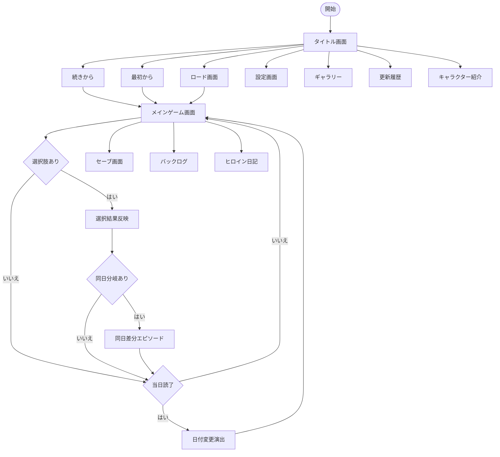

# 放課後シグナル UI/UX 草案

## 0. この文書の位置づけ
- 本文書は **演出案・画面草案** を整理するための補助文書とする
- 正式な実装仕様は `SPEC.md` を正とする
- モジュール責務は `USECASE.md` と `SPEC.md` を正とする
- 本文書の内容が `SPEC.md` と衝突する場合は `SPEC.md` を優先する

---

## 1. UI コンセプト
- 基調は **ノスタルジック / 清潔感 / 読みやすさ優先**
- 90年代恋愛ゲームらしい空気感を残しつつ、現代ブラウザで無理のない軽量な表現に寄せる
- 初版では、派手な演出よりも視認性、操作の安定性、誤タップ防止を優先する

### 1.1 初版の技術方針
- HTML / CSS / JavaScript / JSON を中心に構成する
- ビルドなしで動作する構成を優先する
- 外部UIライブラリや CDN 依存は **初版必須にしない**
- 必要な演出は CSS アニメーションと軽量な JavaScript で実装する

### 1.2 将来導入候補
- GSAP
- Animate.css
- Google Fonts
- 外部アイコンライブラリ
- パーティクル演出ライブラリ

上記は演出強化の候補であり、初版の採用確定事項ではない。

---

## 2. 画面遷移草案



### 2.1 遷移ルール
- `1日 = 1ターン` を維持する
- `day-002a` / `day-002b` のような分岐は **同一日内差分**
- 選択肢確定時には `currentDay` を進めない
- 当日エピソードを最後まで読了した時点で次の日へ進む

---

## 3. 画面レイアウト草案

### 3.1 タイトル画面
- 主要操作は **中央寄せの縦並びメニュー**
- 画面上部または中央にタイトルロゴ
- 下部に広告エリアを置くが、操作群から十分な余白を空ける
- `続きから` はセーブあり時に強調する
- `最初から` は進行データのみ削除する導線であり、全データ削除とは分ける

**初版演出案**
- 背景画像の穏やかなフェード
- ロゴのごく軽い浮遊
- 季節感を出す軽微な背景オーバーレイ

**避けること**
- 右下固定メニュー
- 広告と近接した操作配置
- 過剰なパーティクル常時演出

### 3.2 メインゲーム画面
- 背景
- キャラ立ち絵またはイベントCG
- 日付表示
- テキストウィンドウ
- キャラ名欄
- 選択肢
- 常設操作: `Skip`, `Log`, `Settings`
- 補助表示: 音量ミニアイコン

**将来拡張候補**
- `Auto`
- `Menu`

### 3.3 セーブ / ロード画面
- オートセーブ 1枠
- 手動セーブ 3枠
- 日時表示
- 話数表示
- 好感度簡易表示

### 3.4 ギャラリー画面
- MVPではイベントCGのみ対象
- 画像単位で解放
- 未取得CGはシルエット表示
- 解放率を表示
- 背景画像は対象外

### 3.5 日記画面
- ヒロインごとの一覧
- 解放済みのみ閲覧可能
- 本編読了と連動して開放

---

## 4. レイアウト図

### 4.1 メインゲーム画面

```text
+--------------------------------------------------------------+
| Date                                        Volume Icon      |
|                                                              |
|                      Character / Event CG                    |
|                                                              |
|                                                              |
|  Name Tag                                                    |
| +----------------------------------------------------------+ |
| | Message Window                                           | |
| | Dialogue Text                                            | |
| +----------------------------------------------------------+ |
|                           [Skip] [Log] [Settings]           |
+--------------------------------------------------------------+
```

### 4.2 スマホ縦持ち

```text
+------------------------------+
| Date         Volume Icon     |
|                              |
| Character / Event CG         |
|                              |
| Name Tag                     |
| +--------------------------+ |
| | Message Window           | |
| | Dialogue Text            | |
| +--------------------------+ |
| [Skip] [Log] [Settings]     |
+------------------------------+
```

---

## 5. アニメーション方針

### 5.1 初版で採用する演出
- 画面フェード
- 立ち絵の穏やかな表示切替
- 選択肢ホバー時の軽い色変化
- 日付変更時の短いトランジション
- 好感度上昇時の控えめなハイライト

### 5.2 初版で抑制する演出
- 常時パーティクル
- 強いパララックス
- 本文1文字ごとの Bounce
- 常時 Shake
- ネオン風の強い発光

### 5.3 テキスト演出
- 通常本文はシンプルなタイプライター、または即時表示
- 強調は色、ウェイト、短いフェード程度に留める
- Shake は重要イベントなど限定演出にのみ使用可能

---

## 6. レスポンシブ方針
- PC は横長配置を基本とする
- スマホ縦持ちは「上にビジュアル、下にテキスト」のノベル形式へ再配置する
- 操作ボタンはタップしやすいサイズを確保する
- 広告は操作導線から分離し、誤タップを誘う位置に置かない
- 下部固定ナビゲーションは初版では採用しない

---

## 7. 実装責務との対応

本文書の UI 要素は、以下の既存モジュール責務に合わせる。

| 役割 | 主担当 |
|------|--------|
| 画面切替 | `router.js` |
| 背景・立ち絵・テキスト・選択肢描画 | `renderer.js` |
| 進行状態・パラメータ・フラグ更新 | `state.js` |
| セーブ / ロード | `storage.js` |
| BGM / SE | `audio.js` |
| JSON 読み込み | `dataLoader.js` |
| アプリ起動と初期化 | `main.js` |

独自の `UI_Manager` などは正式責務としては採用しない。

---

## 8. 実装ステップ
1. CSS Variables で色、余白、ウィンドウ透明度を定義する
2. タイトル画面とメイン画面の静的レイアウトを作る
3. `renderer.js` でテキスト、立ち絵、選択肢描画を固める
4. `router.js` でタイトル / ゲーム / 設定 / ギャラリー導線をつなぐ
5. `storage.js` で手動セーブ3枠とオートセーブを実装する
6. `audio.js` で初回操作後の音声初期化を入れる
7. 最後に必要最小限の演出だけ追加する

---

## 9. 今後の昇格条件
- `SPEC.md` と矛盾がないこと
- 採用技術が確定していること
- 操作要素と画面遷移が実装仕様と一致していること
- モジュール責務が `USECASE.md` と一致していること

この条件を満たした時点で、本書を UI 正式仕様へ昇格できる。
